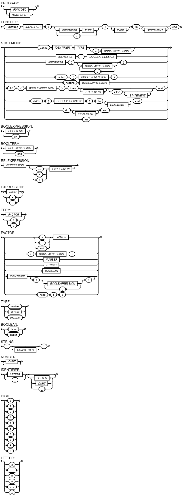

# Compilador-Rodrigo-M


Projeto de compilador desenvolvido para a matéria de **Lógica Computacional**, implementado em Kotlin. O compilador suporta dois modos de operação: **interpretação** (execução direta do código-fonte) e **compilação** (geração de código assembly NASM para Linux x86 32-bit).

---

## Versão 1.0 — Suporte a Funções e Escopo de Variáveis

### Diagrama Sintático



---

## Funcionalidades

### Tipos de Dados

| Tipo      | Descrição                          | Exemplos                    |
|-----------|------------------------------------|-----------------------------|
| `number`  | Inteiros de 32 bits com sinal      | `42`, `-7`, `0`             |
| `string`  | Sequências de caracteres           | `"olá mundo"`, `"abc"`      |
| `boolean` | Valores lógicos                    | `true`, `false`             |

### Operadores

**Aritméticos** (sobre `number`): `+`, `-`, `*`, `/`

**Relacionais**: `==`, `<`, `>` — suportam `number` vs `number` e `string` vs `string`

**Lógicos** (sobre `boolean`): `and`, `or`, `not`

**Concatenação** (string ou qualquer tipo): `..`

### Comandos

| Comando      | Sintaxe                                              | Descrição                                 |
|--------------|------------------------------------------------------|-------------------------------------------|
| Declaração   | `local x number`                                     | Declara variável com tipo                 |
| Inicialização| `local x number = 10`                                | Declara e inicializa                      |
| Atribuição   | `x = expressão`                                      | Atribui valor a variável existente        |
| Saída        | `print(expressão)`                                   | Imprime valor seguido de nova linha       |
| Entrada      | `x = read()`                                         | Lê valor do stdin                         |
| Condicional  | `if (cond) then ... else ... end`                    | Desvio condicional com `else` opcional    |
| Repetição    | `while (cond) do ... end`                            | Laço condicional                          |
| Bloco        | `do ... end`                                         | Bloco de escopo encadeado                 |
| Retorno      | `return expressão`                                   | Retorna valor de uma função               |

### Funções

Funções são declaradas com `function`, recebem argumentos tipados e possuem tipo de retorno declarado (ou `void` se omitido). O escopo é léxico: variáveis declaradas dentro de uma função não são visíveis fora dela.

```lua
function soma(a number, b number) number
  return a + b
end

local resultado number = soma(3, 4)
print(resultado)
```

### Comentários

Comentários de linha são iniciados por `--` e ignorados pelo pré-processador:

```lua
-- isto é um comentário
local x number = 10 -- comentário inline
```

---

## Gramática EBNF

```ebnf
PROGRAM = { FUNCDEC | STATEMENT } ;

FUNCDEC = "function", IDENTIFIER, "(", [IDENTIFIER, TYPE, {",", IDENTIFIER, TYPE}], ")", [TYPE], "\n", {STATEMENT}, "end" ;

STATEMENT =
      "local", IDENTIFIER, TYPE, ["=", BOOLEXPRESSION]
    | IDENTIFIER, "=", BOOLEXPRESSION
    | IDENTIFIER, "(", [BOOLEXPRESSION, {",", BOOLEXPRESSION}], ")"
    | "print", "(", BOOLEXPRESSION, ")"
    | "return", BOOLEXPRESSION
    | "if", "(", BOOLEXPRESSION, ")", "then", {STATEMENT}, ["else", {STATEMENT}], "end"
    | "while", "(", BOOLEXPRESSION, ")", "do", {STATEMENT}, "end"
    | "do", {STATEMENT}, "end"
    | "\n" ;

BOOLEXPRESSION = BOOLTERM, { "or", BOOLTERM } ;
BOOLTERM       = RELEXPRESSION, { "and", RELEXPRESSION } ;
RELEXPRESSION  = EXPRESSION, [("==" | "<" | ">"), EXPRESSION] ;
EXPRESSION     = TERM, { ("+" | "-"), TERM } ;
TERM           = FACTOR, { ("*" | "/"), FACTOR } ;

FACTOR =
      ("+" | "-" | "not"), FACTOR
    | "(", BOOLEXPRESSION, ")"
    | NUMBER
    | STRING
    | BOOLEAN
    | IDENTIFIER, ["(", [BOOLEXPRESSION, {",", BOOLEXPRESSION}], ")"]
    | "read", "(", ")" ;

TYPE       = "number" | "string" | "boolean" ;
BOOLEAN    = "true" | "false" ;
STRING     = '"', { CHARACTER }, '"' ;
NUMBER     = DIGIT, { DIGIT } ;
IDENTIFIER = (LETTER | "_"), { LETTER | DIGIT | "_" } ;
DIGIT      = "0" | "1" | "2" | "3" | "4" | "5" | "6" | "7" | "8" | "9" ;
LETTER     = "a" | ... | "z" | "A" | ... | "Z" ;
```

---

## Arquitetura do Compilador

O compilador segue o pipeline clássico de fases, todas implementadas em `main.kts`:

```
Código-fonte
     │
     ▼
 [Prepro]         Pré-processador — remove comentários (--.*)
     │
     ▼
 [Lexer]          Analisador léxico — tokeniza o fonte
     │
     ▼
 [Parser]         Analisador sintático — constrói a AST (Árvore Sintática Abstrata)
     │
     ▼
   [AST]          Árvore de nós (Node, BinOp, If, While, FuncDec, ...)
     │
     ├─── evaluate(ST) ──► Interpretador (execução direta)
     │
     └─── generate(ST)  ──► Gerador de código (assembly NASM x86 32-bit)
```

### Componentes Principais

| Componente | Classe(s)                       | Responsabilidade                                      |
|------------|---------------------------------|-------------------------------------------------------|
| Pré-proc.  | `Prepro`                        | Remove comentários com regex                          |
| Léxico     | `Lexer`, `Token`                | Tokenização do código-fonte                           |
| Sintático  | `Parser`                        | Análise descendente recursiva, produz AST             |
| AST        | `Node` e subclasses             | Representação em memória do programa                  |
| Semântico  | Dentro de `evaluate`            | Checagem de tipos e escopos                           |
| Tabela de símbolos | `ST` (Symbol Table)    | Gerencia variáveis e funções com encadeamento de escopo |
| Interpretador | `evaluate(ST)`               | Execução direta da AST                                |
| Gerador    | `generate(ST)`, `Code`          | Emissão de instruções NASM x86                        |

### Nós da AST

| Nó           | Descrição                                              |
|--------------|--------------------------------------------------------|
| `IntVal`     | Literal inteiro                                        |
| `BoolVal`    | Literal booleano                                       |
| `StringVal`  | Literal string                                         |
| `Identifier` | Referência a variável                                  |
| `VarDec`     | Declaração de variável (`local`)                       |
| `Assignment` | Atribuição (`x = expr`)                                |
| `BinOp`      | Operação binária (`+`, `-`, `*`, `/`, `==`, `<`, etc.) |
| `UnOp`       | Operação unária (`+`, `-`, `not`)                      |
| `Print`      | Comando `print`                                        |
| `Read`       | Comando `read`                                         |
| `If`         | Condicional com `else` opcional                        |
| `While`      | Laço de repetição                                      |
| `Block`      | Sequência de statements com escopo próprio             |
| `FuncDec`    | Declaração de função                                   |
| `FuncCall`   | Chamada de função                                      |
| `Return`     | Retorno de função                                      |
| `NoOp`       | Operação nula (linhas em branco)                       |

---

## Escopo de Variáveis

A tabela de símbolos `ST` suporta **escopo léxico encadeado** via campo `parent`. Ao entrar em um bloco `do...end` ou em uma chamada de função, uma nova `ST` é criada encadeada à `ST` pai. A busca por variáveis percorre a cadeia até encontrar o símbolo ou lançar erro semântico.

```lua
local x number = 10
do
  local x number = 20  -- x local ao bloco
  print(x)             -- imprime 20
end
print(x)               -- imprime 10
```

---

## Geração de Código Assembly

No modo de compilação, o compilador emite assembly NASM compatível com Linux x86 32-bit. O código gerado usa:

- **EBP/ESP** para gerenciar o frame de pilha
- **EAX** como registrador de resultado de expressões
- **ECX** como registrador auxiliar em operações binárias
- `printf` / `scanf` do libc para I/O
- Interrupção `int 0x80` (syscall Linux) para saída do processo

Variáveis locais são alocadas na pilha com `sub esp, 4` e referenciadas como `[ebp - N]`.

---

## Como Usar

### Pré-requisitos

- [Kotlin](https://kotlinlang.org/docs/command-line.html) instalado e `kotlinc` disponível no PATH

### Execução (modo interpretador)

```bash
kotlinc -script main.kts arquivo.lua
```

### Compilação (modo gerador de assembly)

```bash
kotlinc -script main.kts -c arquivo.lua
# Gera arquivo.asm no mesmo diretório
```

Para montar e executar o assembly gerado (Linux x86):

```bash
nasm -f elf32 arquivo.asm -o arquivo.o
ld -m elf_i386 arquivo.o -o arquivo -lc -dynamic-linker /lib/ld-linux.so.2
./arquivo
```

> O servidor de testes executa o programa com:
> ```
> kotlinc -script main.kts [argumentos]
> ```

---

## Exemplos

### Fibonacci iterativo

```lua
local n number = 10
local a number = 0
local b number = 1
local i number = 0

while (i < n) do
  local tmp number = b
  b = a + b
  a = tmp
  i = i + 1
end

print(a)
```

### Fatorial com função

```lua
function fatorial(n number) number
  local resultado number = 1
  while (n > 1) do
    resultado = resultado * n
    n = n - 1
  end
  return resultado
end

print(fatorial(6))
```

### Concatenação de strings

```lua
local nome string = "Mundo"
print("Olá, " .. nome .. "!")
```

### Leitura e condicional

```lua
local x number = read()
if (x > 0) then
  print(1)
else
  print(0)
end
```

---

## Limitações da Geração de Código

O backend de assembly possui as seguintes restrições na versão atual:

- Tipos `string` não possuem geração de código (apenas interpretação)
- Chamadas de função (`FuncCall`) e declarações de função (`FuncDec`) ainda não geram código assembly — apenas executam corretamente no modo interpretador
- O assembly gerado é específico para **Linux x86 32-bit** (usa `int 0x80` e convenções ELF)

---

## Gerenciamento de Tags

Para publicar uma nova versão:

```bash
git tag v1.0.0
git push origin v1.0.0
```

---

## Estrutura do Projeto

```
Compilador-Rodrigo-M/
├── main.kts          # Fonte completo do compilador (lexer, parser, AST, semântico, codegen)
├── imgs/
│   └── image4.png    # Diagrama sintático atual
└── README.md
```